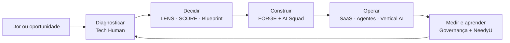

# Trustyu.ai · Tech Human · NeedyU.ai

### Tecnologia com clareza, humanidade e resultado.

**Unimos especialistas seniores e agentes de IA para transformar problemas reais em software seguro, operável e em uso.**

🇧🇷 Brasil · 🇺🇸 Estados Unidos · Produtos e serviços em português e inglês

---

## Em 10 segundos

Somos um **AI-native company builder**. Construímos SaaS verticais, agentes de IA e produtos de Vertical AI com squads embarcados que respondem pelo resultado — não apenas pelas horas trabalhadas.

- **Tech Human** encontra o gargalo, organiza a decisão e lidera a execução.
- **Trustyu.ai** transforma visão e conhecimento de domínio em produto e ativo de tecnologia.
- **NeedyU.ai** converte reuniões, rotinas e conhecimento em memória operacional e produtividade.
- **FORGE** é o sistema de engenharia que conecta intenção, build, verificação, evidência e aprendizado.

> Não começamos pela ferramenta. Começamos pela dor que precisa virar resultado.

---

## Um ecossistema, papéis claros

| | Papel no ecossistema | Quando faz sentido |
|---|---|---|
| **[Tech Human](https://www.techhuman.com.br)** | Diagnóstico, estratégia, CTO/CPO as a Service, dados, IA aplicada e squads especialistas | Quando a operação trava antes da tecnologia ou falta direção para executar |
| **[Trustyu.ai](https://www.trustyu.ai)** | AI squads, produtos de IA, Vertical SaaS e co-building com fundadores e empresas | Quando existe uma visão ou domínio forte que precisa virar software e outcome |
| **[NeedyU.ai](https://www.techhuman.com.br/cases/needyu-ai)** | Copiloto de produtividade, reuniões e conhecimento operacional | Quando informação dispersa precisa virar memória, insight e ação |
| **[FORGE](https://forge.trustyu.ai)** | Framework proprietário de lançamento e engineering harness | Quando velocidade precisa coexistir com segurança, controle e evidência |

---

## Da dor ao software em uso

O ciclo é simples de explicar e rigoroso de executar: entender o problema, reduzir a aposta, construir com controles verificáveis, colocar em uso e aprender com a operação real.

---

## O que já construímos

### Produtos e soluções

| Maturidade | Ativo | O que entrega |
|---|---|---|
| 🟢 **No ar** | **[NeedyU.ai](https://www.techhuman.com.br/cases/needyu-ai)** | Copiloto de produtividade que centraliza reuniões, conhecimento, rotinas e insights |
| 🟢 **No ar** | **CRM de Imigração + Agentes** | SaaS vertical com pipeline, atendimento omnichannel e agentes de qualificação, avaliação, notificação e follow-up |
| 🟢 **Em operação** | **Hub Agents** | Motor multi-tenant que cria, orquestra e publica agentes via REST, WebSocket e SSE para os produtos do ecossistema |
| 🟢 **Validado** | **[Trustyu SCORE](https://www.trustyu.ai/score)** | Auditoria independente de arquitetura, código, segurança, produto e mercado, com score e roadmap de remediação |
| 🟢 **Disponível** | **[Trustyu LENS](https://www.trustyu.ai/forge-lens)** | Transforma uma ideia crua em material visual de decisão: oportunidade, mercado, riscos e próximo passo |
| 🟡 **Product-market fit** | **AI-Native HR** | Prática sênior de pessoas e RH potencializada por IA para tornar a função mais estratégica |
| 🔬 **R&D / POC** | **Process Intelligence** | Converte entrevistas, transcrições e documentos em processos estruturados, BPMN e specs operacionais |

### A plataforma por trás dos produtos

| Camada | Capacidade |
|---|---|
| **FORGE 3.0** | Seis fases, controles versionados, execução isolada, verificação independente, evidência e aprendizado contínuo |
| **Product Foundation** | Multi-tenancy, identidade, billing, internacionalização, observabilidade, CI/CD, segurança e golden paths reutilizáveis |
| **Hub Agents** | Agentes por domínio, RAG, múltiplos provedores de LLM, canais plugáveis, workers assíncronos e observabilidade |
| **Human + AI Squad** | Responsabilidade humana, papéis especialistas, agentes executores e verificadores independentes no mesmo fluxo |

Cada produto novo herda a fundação. O domínio muda; os princípios, controles e aprendizados permanecem.

---

## O que estamos forjando

O portfólio está aberto a novas verticais onde conhecimento profundo de domínio encontra uma oportunidade real de IA:

`Saúde` · `Jurídico` · `Seguros` · `Imobiliário` · `Construção` · `Serviços profissionais`

Hoje, conceitos como **Meddus**, **Advogus**, **Insurus**, **Imobly** e **Construs** representam teses de co-building — não produtos genéricos prontos. Cada vertical nasce com um parceiro de domínio, primeiros usuários e um resultado mensurável.

[Conheça o portfólio e os modelos de parceria →](https://www.trustyu.ai)

---

## Como engenhamos confiança

- **Humano accountable** — pessoas definem intenção, risco aceito e decisões irreversíveis.
- **IA sob contrato** — cada agente atua dentro de escopo, ferramentas e ambiente autorizados.
- **Verificação independente** — quem executa não é a única autoridade sobre o próprio trabalho.
- **Evidência antes da afirmação** — testes, scans, evals e receipts sustentam o que declaramos pronto.
- **Segurança e privacidade por design** — least privilege, isolamento e minimização de dados desde a arquitetura.
- **Aprendizado que vira sistema** — falhas e reviews retornam como teste, controle, eval ou melhoria reutilizável.

É assim que buscamos velocidade sem transformar confiança em promessa de marketing.

---

## Por onde começar

| Se você… | Comece aqui |
|---|---|
| Tem uma dor operacional, mas ainda não sabe qual tecnologia contratar | **[Digital Business Assessment](https://www.techhuman.com.br/servicos/digital-business-assessment)** |
| Quer entender a maturidade e os riscos do uso de IA na empresa | **[Diagnóstico de Maturidade IA](https://www.techhuman.com.br/maturidade-ia)** |
| Tem uma ideia e precisa decidir se vale a pena construir | **[Trustyu LENS](https://www.trustyu.ai/forge-lens)** |
| Já tem um sistema com IA e quer saber se ele está seguro e preparado para crescer | **[Trustyu SCORE](https://www.trustyu.ai/score)** |
| Tem domínio de mercado e procura um parceiro técnico para co-construir | **[Fale com a Trustyu](https://www.trustyu.ai/get-started)** |
| Precisa de liderança técnica, produto e squad para executar | **[Veja como a Tech Human atua](https://www.techhuman.com.br/como-atuamos)** |

---

## GitHub e código aberto

Grande parte do nosso código é privada porque contém propriedade intelectual de produtos, integrações e contexto de clientes. Tornamos público o que pode gerar aprendizado sem comprometer segurança ou confidencialidade.

Hoje você pode explorar:

- **[FORGE — site público](https://github.com/needyuai/trustyu-jarvis-site)** — visão pública do framework e da tese de engenharia.
- **[Configuração da organização](https://github.com/needyuai/.github)** — arquivos de comunidade, contribuição e segurança.

Antes de contribuir, leia o **[guia de contribuição](https://github.com/needyuai/.github/blob/main/CONTRIBUTING.md)** e o **[Código de Conduta](https://github.com/needyuai/.github/blob/main/CODE_OF_CONDUCT.md)**. Vulnerabilidades nunca devem ser abertas em issues públicas: siga a nossa **[Política de Segurança](https://github.com/needyuai/.github/security/policy)**.

---

## Princípios inegociáveis

**Pessoa no centro** · **Excelência com simplicidade** · **Alianças justas** · **Stewardship** · **Liderança servidora** · **Generosidade e give back**

Construímos tecnologia para ampliar capacidade humana — com responsabilidade, clareza e compromisso com o resultado que permanece depois da entrega.

---

### Vamos transformar uma dor real em software em uso?

Segurança: <a href="mailto:security@trustyu.ai">security@trustyu.ai</a> · Founder: <a href="https://fernandoparreiras.com.br">Fernando Parreiras</a>

  

<em>“Entrega ao Senhor tudo o que você faz, e os seus planos serão bem-sucedidos.”</em> — Provérbios 16:3

<!-- Revisão editorial e factual: 2026-07-14 -->
